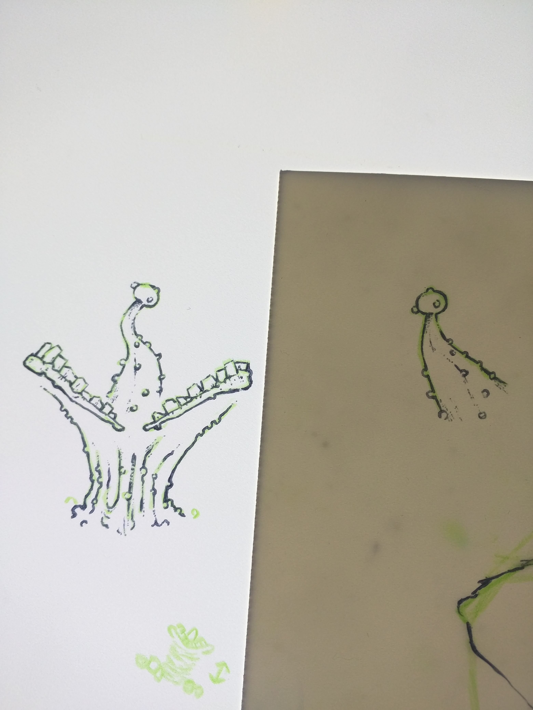
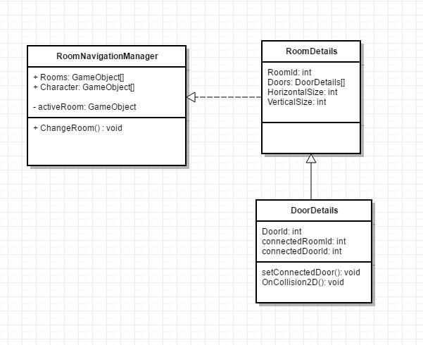

# Game Design
2D side-scrolling, Metroidvania game.

# Game Story
Awoken from her slumber, Ursula rubs her eyes in an attempt to get her bearings. In what looks to be the remnants of an underground government laboratory, she slowly slumps off the experimentation table. Something inside not feel right, but she does not have a chance to investigate as the room starts collapsing. No longer constrained by her captors, she must make her way out of the crumbling, cacophonous caverns.

# Concept Art

# Inspirations
- [U-Men (comics)](https://en.m.wikipedia.org/wiki/U-Men_(comics))
- [CRISPR](https://en.m.wikipedia.org/wiki/CRISPR)
- [We3](https://en.m.wikipedia.org/wiki/We3)
- [Rogue Legacy - Gameplay](https://youtu.be/AfIFidx71WE)
- [Darkest Dungeon](http://www.darkestdungeon.com/)
- [Let's Look At: Chasm!](https://youtu.be/s9_MCpYdqY4)
- [The Berenst(E)ain Bears Conspiracy Theory That Has Convinced the Internet There Are Parallel Universes](http://www.vice.com/read/the-berensteain-bears-conspiracy-theory-that-has-convinced-the-internet-there-are-parallel-universes)
- [Katamari Damacy](https://en.wikipedia.org/wiki/Katamari_Damacy)
- 
- 
- 
- 
- 
- 
- 
- 
- 
- 

# UML
## Room Navigation
First draft of class diagrams for rooms and doors
- 

Made with [Gliffy | Online Diagram and Flowchart Software](https://www.gliffy.com/)

# Tutorials
- [Procedural Cave Generation tutorial
](https://unity3d.com/learn/tutorials/projects/procedural-cave-generation-tutorial)
